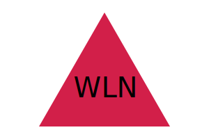

# Logo Maker (Module 10 Homework - OOP)

The goal was to create a command line application that creates a simple logo for the user. The requirements were:
- The user can enter up to three characters for their logo.
- The user can enter a text color.
- The user can choose a shape from the following:
  - Triangle
  - Circle
  - Square
- The user can enter a shape color.
- When the user finishes answering prompts, an SVG file named `logo.svg` will be created and the text "Generated logo.svg" will be printed in the command line.
- The SVG can then be opened and will display a 300x200 pixel image matching the user input.

## Installation

To use the Logo Maker, you will need to follow these instructions:
- Download the project file to your computer.
- In command line:
  ```
  npm init
  ```
  ```
  npm install
  ```
  - confirm that the `inquirer` and `jest` packages were installed and active.

## Usage

- To start the README Generator, run: 

  ```
  node index.js
  ``` 

  in the command line. You will then answer prompts to generate the logo.

- If you choose not to answer a prompt in the terminal, you will be required to answer all prompts again.
- If you use more than 3 characters for the text prompt, you will be required to answer all prompts again.

# Testing

- To test, make sure the `jest` npm is installed
- In the terminal:
  ```
  npm run test
  ```


## Visual Example of Generated README




## Video Demo

[Link to Demo Video](https://watch.screencastify.com/v/RgutWQIgY9iayJUtEtbB)
